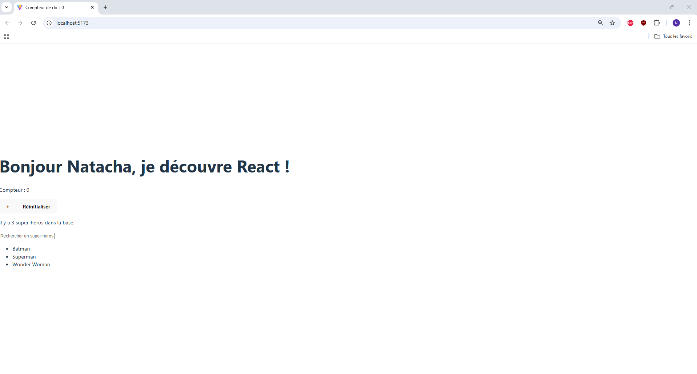
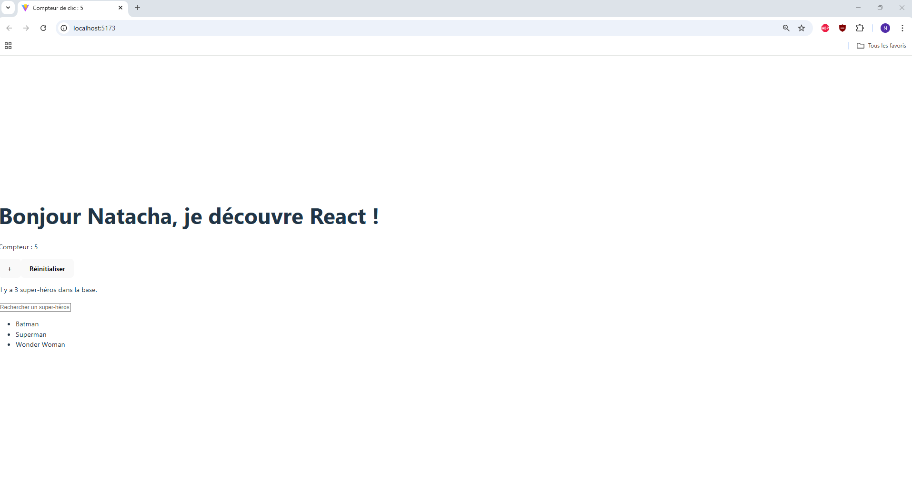
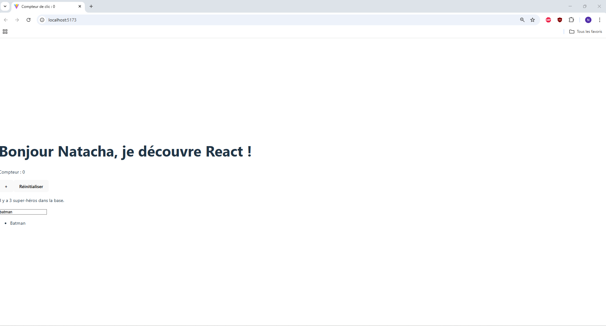

# TD React - Exercices pratiques avec Vite

Bienvenue dans mon projet **td-react-intro**, réalisé dans le cadre du TD React.
Ce projet utilise **React**, **TypeScript** et **Vite** pour explorer les bases du
développement d'une application web interactive.

---

## Installation et démarrage

```bash
# Cloner le projet
git clone https://github.com/Natacha62/TD-React.js.git
cd TD-React.js

# Installer les dépendances
npm install

# Lancer le serveur de développement
npm run dev
```

## Fonctionnalités implémentées

* Affichage d'un message personnalisé avec une variable
* Gestion d'un compteur avec **useState** et boutons d'interaction
* Mise à jour du titre de la page avec **useEffect**
* Importation et affichage d'un fichier JSON contenant des super-héros
* Affichage dynamique de la liste avec **.map()**
* Champ de recherche pour filtrer les super-héros en temps réel

## Structure du projet

La structure du projet est celle générée automatiquement par Vite. Les seules modifications apportées sont :

- `src/App.tsx` : Composant principal modifié pour intégrer les fonctionnalités du TD (useState, useEffect, etc.)
- `src/SuperHeros.json` : Fichier JSON ajouté contenant les données des super-héros
- `images/` : Dossier ajouté à la racine du projet pour stocker les captures d'écran utilisées dans le README

## Aperçu de l'application

1. L'état initial



2. Le compteur qui change



3. Le filtre des super-héros

